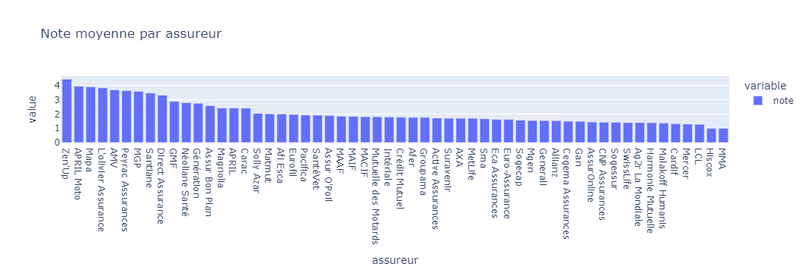
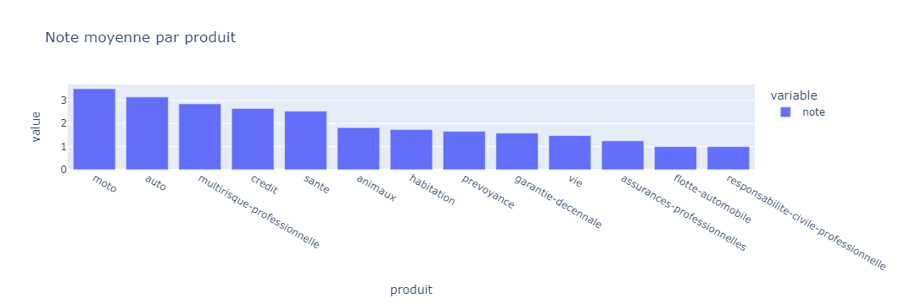
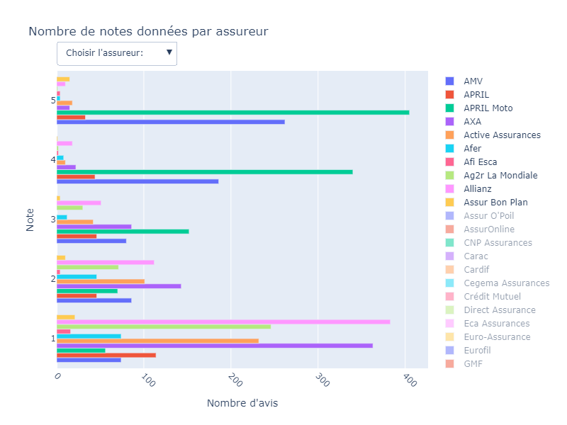
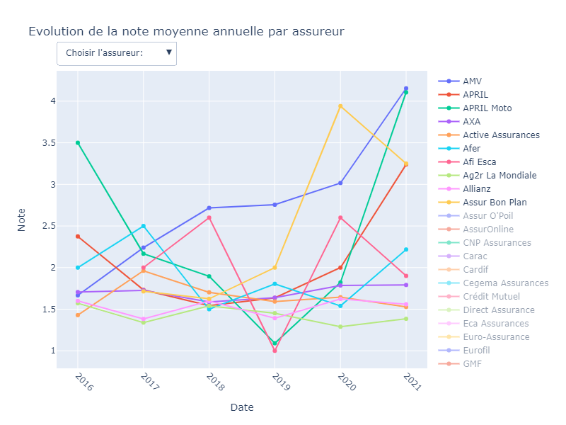
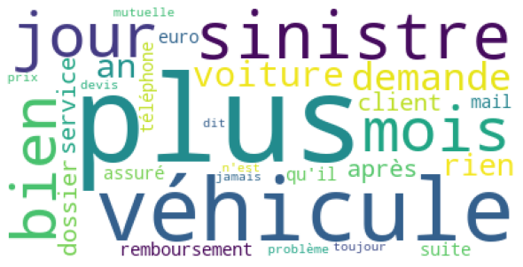
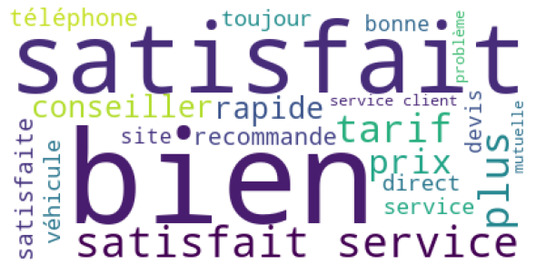
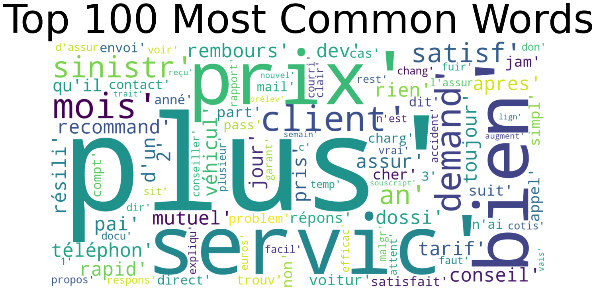

01/2022 | ESILV A5 - DIA 3  
CELIE Kévin - CHEICK ISMAIL Mariyam

Link to GitHub : https://github.com/m-cheicki/NLP_Project_2

# Advanced Machine Learning for NLP and Text Processing

## Project 2 : Insurance reviews

### Structure du projet

- README.md : rapport
- <a href="./CELIE_CHEICKISMAIL_NLP_PROJECT2_INSURANCE.ipynb">CELIE_CHEICKISMAIL_NLP_PROJECT2_INSURANCE.ipynb</a> : notebook
- dataset : dossier contenant les datasets de train et de test

### Préparer le jeu de données

La première étape dans la préparation du jeu de données aura été de convertir la date, données au format _"1 Janvier 1970"_, au format datetime _"yyyy-mm-dd"_.
La seconde étape a été de gérer les NaN, les seules valeurs manquantes étant dans les colonnes auteur et avis, nous avons pris la décision de les remplacer par des strings. On est parti du principe que l'absence d'avis pouvait être un avis en soi.

### Pré-Processing

#### Stop words

Nous avons fait le choix d'utiliser les mots d'arrêts fourni par la librairie nltk. Cependant nous avons du rajouter pas mal de mots qui n'étaient pas présent . On a prit la liberté de rajouter certains mots relatifs au monde de l'assurance tel que _assurance_ ou _contrat_. Ce choix a été fait suite à notre exploration du jeu de données, où nous avons pu voir que ces mots étaient les plus représentés. Ils ne représentent, cependant, pas  un grand intérêt pour nous puisque quelque soit la note ces mots sont présent.

#### Tokenization & Stemming

Pour cette étape, notre choix c'est porté sur word_tokenize et SnowballStemmer de nltk. Pour la tokenization, word_tokenize a été choisi, car il séparait la ponctuation des mots, comparé à d'autre comme TreebankWordTokenizer. Concernant le stemming nous n'avons pas eu énormément de choix, en effet c'est le seul stemmer qui fasse le francais, que nous avons pu trouver. Nous nous sommes rendu compte par la suite qu'il n'est pas forcément très bon. Il y aurait sûrement des points à améliorer de ce coté ci.

### Visualisation

#### Exploration générale

Nous avons dans un premier temps souhaité regarder les notes moyenne par assureur et par produit pour découvrir un peu les données. On se rend compte que les agences d'assurance de moto et les contrats d'assurance moto, on les moyennes les plus hautes.

Par la suite nous avons regardé le nombre d'avis pour chaque note pour chaque assureur, pour voir la repartition. Dans la visualisation ci-dessous nous avons uniquement affiché les notes pour les 10 premières assurances alphabétiquement parlant.

Pour finir, nous avons souhaité voir l'évolution au fil du temps des notes moyennes des assureurs.

#### N-gram

On a par la suite visualiser autour de la NLP, on s'est alors ateler à la visualisation des N-gram, plus précisément 2, 3, 4.

Cette visualisation nous a principalement permis de voir qu'il y a encore beaucoup à faire sur les mots d'arrêts et le stemming.

#### Word clouds

Nous avons ensuite chercher à voir quel sont les mots les plus usités dans les avis en fonction de la note. Les visualisations ci-dessous représente cela avec de gauche a droite et de haut en bas les notes de 1, 2, 3, 4, 5 et les mot les plus utilisé tout avis confondu. On reconnait des patterns de mots au sein des notes les plus hautes (4,5) et les notes les plus basses (1,2). Le 3 semble regrouper un mix des patterns des deux côtés.

### Unsupervised Learning

#### LDA

#### Word2vec

### Supervised Learning

Concernant l'apprentissage supervisé, nous avons essayé deux approches. La première, et celle qui nous a semblé la plus pertinente à la vue du sujet, est la classifaction. Cependant à la vue de l'énoncé, qui aiguillait sur un autre chemin, et par curiosité nous avons aussi explorer de la regression.

#### Classification

Tableau récapitulatif des précisions obtenus:

|             | Naives Bayes | SVM          | RandomForest Classifier |
| :---------- | :----------: | :----------: | :---------------------: |
| Defaut      | 0.530        | 0.519        | 0.525                   |
| GridSearch  | 0.533        | 0.521        | Na                      |

#### Regression

Tableau récapitulatif des RMSE obtenus:

|             | RandomForest | Gradient Boosting |
| :---------- | :----------: | :---------------: |
| Defaut      | 0.887        | 0.977             |
| GridSearch  | 1.097        | 0.921             |

### Conclusion

# Divers

- Parler des blabla et textes en anglais dans la conclusion.
- Parler de ce qui aurait pu être fait en plus.
