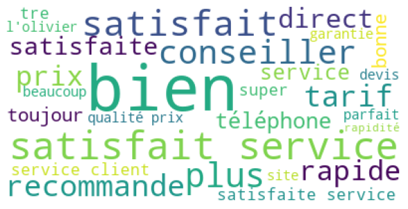

01/2022 | ESILV A5 - DIA 3  
CELIE Kévin - CHEICK ISMAIL Mariyam

Link to GitHub : https://github.com/m-cheicki/NLP_Project_2

# Advanced Machine Learning for NLP and Text Processing

## Project 2 : Insurance reviews

### Structure du projet

- README.md : rapport
- <a href="./CELIE_CHEICKISMAIL_NLP_PROJECT2_INSURANCE.ipynb">CELIE_CHEICKISMAIL_NLP_PROJECT2_INSURANCE.ipynb</a> : notebook
- dataset : dossier contenant les datasets de train et de test
- dataviz : dossier contenant des captures d'écran des visualisations effectuées
- model.bin et word2vec.model : deux fichiers générés par le modèle de "word embedding" Word2Vec

### Préparer le jeu de données

La première étape dans la préparation des données fut la conversion de la date dans le format adéquat. En effet, les données étaient de la forme _"1 Janvier 1970"_ avec d'autres informations non nécessaires pour la suite du traitement. Nous les avons donc transformés au format datetime _"yyyy-mm-dd"_ pour les rendre exploitables. 

La seconde étape fut la gestion des valeurs nulles. Nous avons remarqué qu'il n'existait qu'une seule valeur nulle pour la colonne des auteurs et une seule pour les avis. Nous avons fait le choix de les remplacer par des chaines de charactères vides. Lla colonne de la note, de l'assureur et du produit étant renseigné nous nous sommes dit qu'il est préférable de la garder, même si la suppression d'une ligne n'aurait pas énormément d'impacte sur la suite. De plus, l'absence d'avis peut également être considérée comme un avis en lui-même (surtout que la note est renseignée).  

### Pré-Traitement

#### Stop words

Les stop-words, ou mots d'arrêt en français, sont des mots qui ne sont pas indispensables pour la compréhension du contenu en lui même. Une fois exclus, ces termes permettent un traitement plus rapide sur le contenu et les mots-clés qui importent réellement en apportant du sens. De plus, c'est mots d'arrêt sont généralement les mots les plus utilsés dans un texte : les déterminants, les conjonctions de coordination, ... 

Cs mots n'apportant aucune valeur à notre jeu de données et pouvant influencer sur la qualité de nos résultats, nous les enlèvons. Pour cela, nous utilisons la librairie NLTK nous fornissant une liste de mots d'arrêt. 

La limite de cette librairie est qu'elle n'a pas l'air complète en français. Nous décidons donc de la compléter de manière non exhaustive au fur et à mesure, mais cette tâche est très fasitideuse au vu de la richesse de la langue française et du contenu du jeu de données. Par ailleurs, nous cherchons à analyser les avis et les notes données, nous savons que le jeu de données parle d'assurances. Par conséquent, nous décidons également d'y inclure certains termes de ce cadre de notre jeu de données. 

#### Tokenization & Stemming

De plus, il est important de tokeniser les mots pour pouvoir les exploiter individuellement et par groupe, et ainsi analyser la similitude, les récurrences, des liens logiques entre les mots. 
Pour faire cela, nous avons utilisé le word_tockenizer par défaut, c'est-à-dire le TreebankWordTokenizer. 

Pour ce qui est du steeming, nous avons pris le SnowballStemmer de NLTK. Le jeu de données étant en français, il existe très peu de choix, c'est celui que nous avons trouvé qui correspondait à nos attentes minimales.

### Visualisation

#### Exploration générale

Nous avons dans un premier temps souhaité regarder les notes moyenne par assureur et par produit pour découvrir un peu les données. On se rend compte que les agences d'assurance de moto et les contrats d'assurance moto, on les moyennes les plus hautes.

Par la suite nous avons regardé le nombre d'avis pour chaque note pour chaque assureur, pour voir la repartition. Dans la visualisation ci-dessous nous avons uniquement affiché les notes pour les 10 premières assurances alphabétiquement parlant.

Pour finir, nous avons souhaité voir l'évolution au fil du temps des notes moyennes des assureurs.

#### N-gram

On a par la suite visualiser autour de la NLP, on s'est alors ateler à la visualisation des N-gram, plus précisément 2, 3, 4.

Cette visualisation nous a principalement permis de voir qu'il y a encore beaucoup à faire sur les mots d'arrêts et le stemming.

#### Word clouds

Nous avons ensuite chercher à voir quel sont les mots les plus usités dans les avis en fonction de la note. Les visualisations ci-dessous représente cela avec de gauche a droite et de haut en bas les notes de 1, 2, 3, 4, 5 et les mot les plus utilisé tout avis confondu. On reconnait des patterns de mots au sein des notes les plus hautes (4,5) et les notes les plus basses (1,2). Le 3 semble regrouper un mix des patterns des deux côtés.

### Unsupervised Learning

#### LDA

#### Word2vec

### Supervised Learning

Concernant l'apprentissage supervisé, nous avons essayé deux approches. La première, et celle qui nous a semblé la plus pertinente à la vue du sujet, est la classifaction. Cependant à la vue de l'énoncé, qui aiguillait sur un autre chemin, et par curiosité nous avons aussi explorer de la regression.

#### Classification

Tableau récapitulatif des précisions obtenus:

|             | Naives Bayes | SVM          | RandomForest Classifier |
| :---------- | :----------: | :----------: | :---------------------: |
| Defaut      | 0.530        | 0.519        | 0.525                   |
| GridSearch  | 0.533        | 0.521        | Na                      |

#### Regression

Tableau récapitulatif des RMSE obtenus:

|             | RandomForest | Gradient Boosting |
| :---------- | :----------: | :---------------: |
| Defaut      | 0.887        | 0.977             |
| GridSearch  | 1.097        | 0.921             |

### Conclusion

# Divers

- Parler des blabla et textes en anglais dans la conclusion.
- Parler de ce qui aurait pu être fait en plus.
