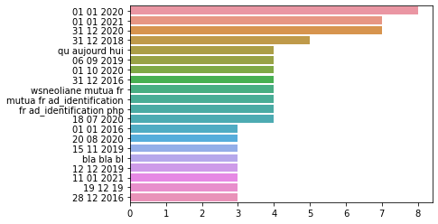

01/2022 | ESILV A5 - DIA 3  
CELIE Kévin - CHEICK ISMAIL Mariyam

Link to GitHub : https://github.com/m-cheicki/NLP_Project_2

[](https://colab.research.google.com/github/m-cheicki/NLP_Project_2/]

# Advanced Machine Learning for NLP and Text Processing

## Project 2 : Insurance reviews

### Structure du projet

- README.md : rapport
- <a href="./CELIE_CHEICKISMAIL_NLP_PROJECT2_INSURANCE.ipynb">CELIE_CHEICKISMAIL_NLP_PROJECT2_INSURANCE.ipynb</a> : notebook
- dataset : dossier contenant les datasets de train et de test
- dataviz : dossier contenant des captures d'écran des visualisations effectuées
- model.bin et word2vec.model : deux fichiers générés par le modèle de "word embedding" Word2Vec

### Préparer le jeu de données

La première étape dans la préparation des données fut la conversion de la date dans le format adéquat. En effet, les données étaient de la forme _"1 Janvier 1970"_ avec d'autres informations non nécessaires pour la suite du traitement. Nous les avons donc transformés au format datetime _"yyyy-mm-dd"_ pour les rendre exploitables. 

La seconde étape fut la gestion des valeurs nulles. Nous avons remarqué qu'il n'existait qu'une seule valeur nulle pour la colonne des auteurs et une seule pour les avis. Nous avons fait le choix de les remplacer par des chaines de charactères vides. La colonne de la note, de l'assureur et du produit étant renseigné nous nous sommes dit qu'il est préférable de la garder, même si la suppression d'une ligne n'aurait pas énormément d'impacte sur la suite. De plus, l'absence d'avis peut également être considérée comme un avis en lui-même (surtout que la note est renseignée).  

### Pré-Traitement

#### Stop words

Les stop-words, ou mots d'arrêt en français, sont des mots qui ne sont pas indispensables pour la compréhension du contenu en lui même. Une fois exclus, ces termes permettent un traitement plus rapide sur le contenu et les mots-clés qui importent réellement en apportant du sens. De plus, ces mots d'arrêt sont généralement les mots les plus utilsés dans un texte : les déterminants, les conjonctions de coordination, ... 

Ces mots n'apportant aucune valeur à notre jeu de données et pouvant influencer sur la qualité de nos résultats, nous les enlèvons. Pour cela, nous utilisons la librairie NLTK nous fournissant une liste de mots d'arrêt. 

La limite de cette librairie est qu'elle n'a pas l'air complète en français. Nous décidons donc de la compléter de manière non exhaustive au fur et à mesure, mais cette tâche est très fastidieuse au vu de la richesse de la langue française et du contenu du jeu de données. Par ailleurs, nous cherchons à analyser les avis et les notes données, nous savons que le jeu de données parle d'assurances. Par conséquent, nous décidons également d'y inclure certains termes de ce cadre de notre jeu de données. 

#### Tokenization & Stemming

De plus, il est important de tokeniser les mots pour pouvoir les exploiter individuellement et par groupe, et ainsi analyser la similitude, les récurrences, des liens logiques entre les mots. 
Pour faire cela, nous avons utilisé le word_tockenizer par défaut, c'est-à-dire le TreebankWordTokenizer. 

Pour ce qui est du stemming, nous avons pris le SnowballStemmer de NLTK. Le jeu de données étant en français, il existe très peu de choix, c'est celui que nous avons trouvé qui correspondait à nos attentes minimales.

### Visualisation

#### Exploration générale

Afin de nous faire une idée de ce que contient le jeu de données, nous avons commencé par regarder les notes moyennes par assureur mais également les moyennes par produit. Nous pouvons observer par exemple, que les assureurs de véhicules (moto et auto) sont les mieux notées. 

Ensuite, nous avons regardé le nombre d'avis pour chaque note de chaque assurance, pour voir la repartition du jeu de données. Dans la visualisation ci-dessous nous avons uniquement affiché les notes pour les 10 premières assurances alphabétiquement parlant.

Pour finir, nous avons souhaité voir l'évolution au fil du temps des notes moyennes annuelles des assureurs afin de voir une tendance temporelle (ont-ils évolué positivement au cours du temps ?)

#### N-grams

Les n-grams permettent de trouver des séquences textuelles, soulignant des récurrences et donc des similitudes entre les différentes phrases ou morceaux de phrases. 
Nous avons pour cela voulu étudier plusieurs type de n-grams : les bigrams, trigrams et les 4-grams. 

Cette visualisation nous permet de voir qu'il y a encore du prétraitement à compléter, que ce soit sur le nettoyage des valeurs numériques qui ne nous intéresse pas (prix, numéro de téléphone, ...), les mots d'arrêt et le stemming. 

#### Word clouds

Nous avons ensuite chercher à voir quel sont les mots les plus utilisés dans les avis en fonction de la note. Les visualisations ci-dessous représentent cela avec, de gauche à droite et de haut en bas, les notes de 1, 2, 3, 4, 5 et les mots les plus utilisés tous avis confondus. On reconnait des patterns de mots au sein des notes les plus hautes (4,5) et les notes les plus basses (1,2). Le 3 semble regrouper un mélange des deux patterns, ce qui semble cohérent. 

### Apprentissage non-supervisé

#### Latent Dirichlet Allocation (LDA)

L'allocation de Dirichlet latente est un modèle génératif probabiliste qui permet d'observer des similarité de données. Il sert notamment pour la détection de thématique d'un document. 

_Source:[Wikipédia](https://fr.wikipedia.org/wiki/Allocation_de_Dirichlet_latente)_

Nous avons adopté deux approches : la première consiste à compter et vectoriser les mots et se baser sur la fréquence d'apparition pour présenter la similitude entre les différents sujets qui seront défini par le modèle. Cette apprcohe génère 10 sujets pour lequels nous pouvons visualiser les n mots les plus fréquents dans ce sujet. 
Cette approche ne nous convenant pas entièrement par le fait que nous ne sachions pas comment ces 10 sujets sont concrètement séparés, nous avons tenté une seconde approche qui consiste à donner les données sous forme de corpus, donner le dictionnaire et le nombre de sujets. L'inconvénient avec cette approche est le fait de devoir spécifier dans le modèle le nombre de sujets, ce qui n'est pas toujours évident de connaitre. Pour notre part, nous avons arbitrairement choisi 5 sujets, car 5 notes possibles. En faisant ainsi, nous avons observé que deux sujets s'englobaient majoritairement. Par conséquent, nous avons décidé de les considérer comme un seul et même sujet. 
Nous partons donc sur un LDA de 4 sujets. 

En visualisant le graph généré, nous pouvons voir que les mots à connotation positive sur trouvent à l'opposé sur un axe des mots à connotation négative. Nous pouvons donc supposer qu'une similitude entre les mots positives a été trouvé de même que pour les mots négatifs, grâce à leur fréquence d'appartition. L'explication du deuxième axe n'est pas une tâche simple, nous n'avons pas réussi à l'expliquer : certains mots nous font penser qu'il pourrait s'agir du service fourni ou demandé (téléphone, remboursement, service, demande, recommandation...)

#### Word2vec

Word2vec est un groupe de modèles utilisé pour le plongement lexical. Ce sont des réseaux de neurones artificiels à deux couches entraînés pour reconstruire le contexte linguistique des mots. 

_Source:[Wikipédia](https://fr.wikipedia.org/wiki/Word2vec)_

Nous avons ici voulu calculer la similitude entre les mots de notre corpus ou encore les mots qui font penser à des synonymes ou qui seraient en lien entre eux. 

### Apprentissage supervisé

Pour cette partie, nous avons tenté deux approches : une approche de classification et une approche de régression. 

#### Classification

Cette approche de classification résulte du raisonnement suivant : nous avons un nombre défini de valeurs de sorties, qui sont des valeurs discrètes, les notes. Nous avons donc considéré qu'une note était une classe et que nous avons donc 5 classes possibles. 

Tableau récapitulatif des précisions obtenus:

|             | Naive Bayes  | SVM          | RandomForest Classifier |
| :---------- | :----------: | :----------: | :---------------------: |
| Defaut      | 0.530        | 0.519        | 0.525                   |
| GridSearch  | 0.533        | 0.521        | NA                      |

#### Regression

Cette approche de régression résulte du raisonnement suivant : nous savons que nos valeurs de sorties sont des valeurs numériques. Même si dans notre cas, il n'existe pas de valeurs continues, ces dernières peuvent être arrondies de sorte à correspondre aux valeurs de sorties attendues. 

Tableau récapitulatif des RMSE obtenus:

|             | Linear Regression | RandomForest | Gradient Boosting |
| :---------- | :---------------: | :----------: | :---------------: |
| Defaut      | 2.138             | 0.887        | 0.977             |
| GridSearch  | NA                | 1.097        | 0.921             |

Dans les deux approches, nous ne pouvons pas dire que nous avons de très bons résultats, une RMSE de cette fourchette pour des valeurs allant de 1 à 5 nous montre que nous nous trompons d'une échelle, ce qui peut être problématique. 

### Conclusion

Lors de l'exploration de ce jeu de données, nous avons remarqué qu'il y avait des mots/expressions qui étaient le plus souvent présents en fonction de la note données (n-grams + wordclouds). Cependant, notre data visualisation n'est pas complète, notamment à cause du prétraitement de notre jeu de donnée qui demande énormément de temps. 
Ce jeu de données étant en français et les fonctions de nettoyage étant plus poussées pour l'anglais, il arrive que le prétraitement ne soit pas complet, qu'il s'agisse des mots d'arrêt ou du stemming. Nous pouvons aussi ajouter que suite au stemming des charactères sont apparus comme les apostrophes ce qui est problématique (pour la LDA par exemple). Aussi, nous avons remarqué qu'il y avait des données en anglais et une personne qui aurait mis des valeurs non sérieuses ("bla bla bla"). En outre, des valeurs numériques se sont glissés dans les avis : numéro de téléphone, prix d'un service..., compliquant le traitement de ces informations et faussant les résulats, notamment pour le 4-grams qui le rend innexploitable. Le prétraitement n'étant pas complet et comme désiré, nous avons eu des difficultés quant à l'interprétation des résultats à certains endroits. 

Ensuite, la visualisation du jeu de données n'est pas suffisante. Il aurait fallu aller encore plus loin et potentiellement créer de nouvelles 'features' grâce aux observations y résultant (feature engineering). 

Pour ce qui est de l'apprentissage supervisé, nous avons pensé à faire un réseau de neurones récurrent (RNN LSTM (Long Short-Term Memory)) exploitant le word2vec obtenu avec l'apprentissage non supervisé. Ce type de réseau de neuronnes à des "feedback connections" ce qui permet de prendre en compte non pas uniquement l'avis mais l'avis et le contexte autour, les autres valeurs... ce qui renforce la manière d'apprendre et donc de comprendre et prédire les notes. 
